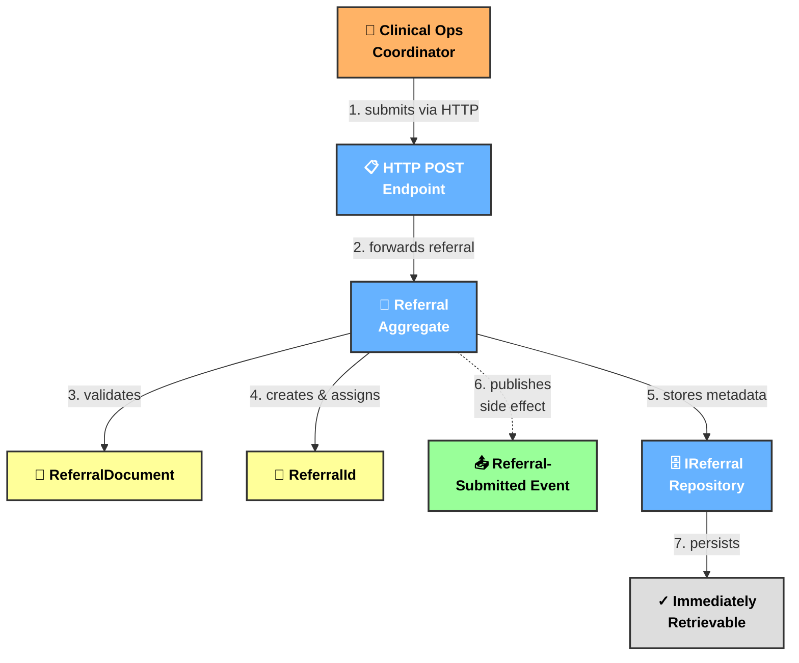
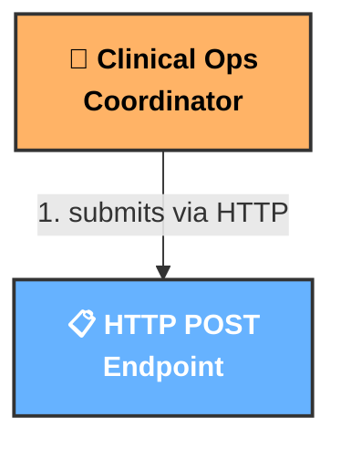
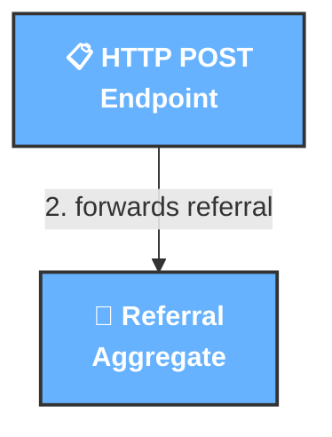
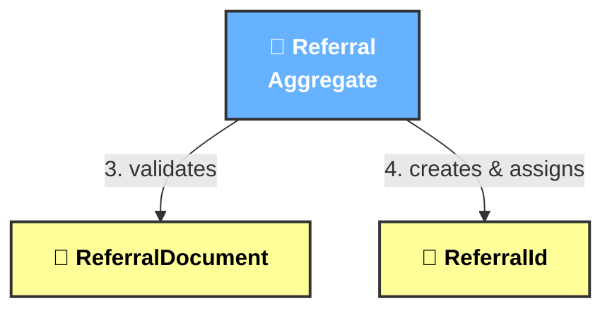
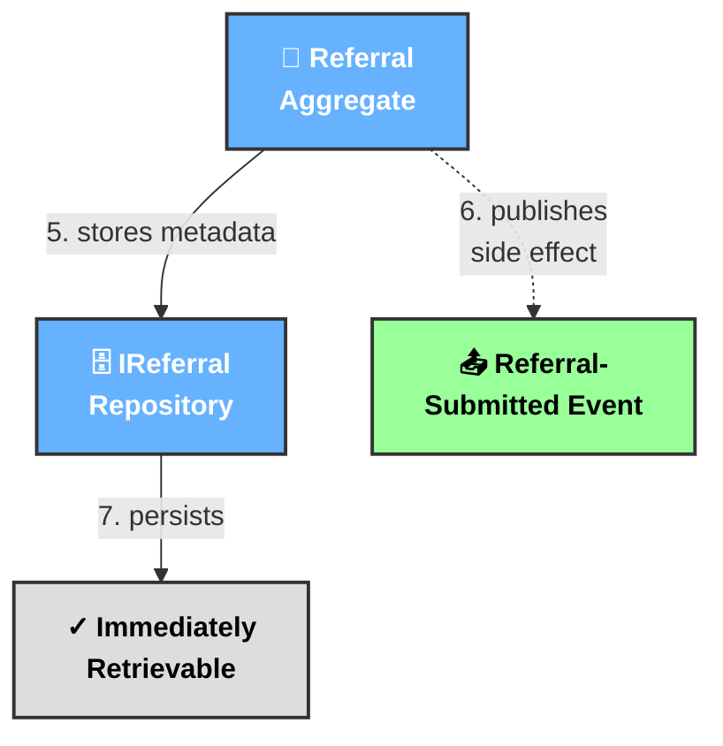

# EXAMPLE: REQ-001 Mapping — Referral Intake

**Source:** [REQ-001.md](../requirements/REQ-001.md)

**Requirement Statement:**
> When a clinical operations coordinator submits a referral document via HTTP POST, the Referral aggregate shall validate that the ReferralDocument has a supported format (pdf, text, image), size between 1 byte and 50 MB, and non-empty storage path. If valid, Referral shall assign a unique ReferralId, store the document metadata, and emit Referral-Submitted event with ReferralId, DocumentFormat, DocumentHash, and SubmittedAt payload. The submitted Referral aggregate shall then be immediately retrievable from IReferralRepository by ReferralId.

---

## PASS 1 — DOMAIN PICTURE

### Nouns Extracted

| Noun | Category | Rationale |
|---|---|---|
| Clinical Operations Coordinator | Actor | Human role initiating action |
| HTTP POST Endpoint | UI Surface | Interface receiving input |
| Referral Aggregate | System | Core domain service processing |
| ReferralDocument | Data Object | Value object representing submitted document |
| ReferralId | Data Object | Unique identifier created as result |
| Referral-Submitted Event | Domain Event | State-changing event published |
| IReferralRepository | System | Service providing persistence/retrieval |

### IMAGE: Domain Picture

```mermaid
graph LR
    LEGEND["📋 LEGEND — Box Types<br/>🔵 Actor | 🟦 System | 📄 Data | 📤 Event"]

    A1["👤 Clinical Ops<br/>Coordinator"]
    UI1["📋 HTTP POST<br/>Endpoint"]
    SYS1["🔷 Referral<br/>Aggregate"]
    REPO1["🗄️ IReferral<br/>Repository"]
    D1["📄 ReferralDocument"]
    D2["🔑 ReferralId"]
    EVT1["📤 Referral-<br/>Submitted Event"]

    LEGEND --- A1 --- UI1 --- SYS1 --- REPO1 --- D1 --- D2 --- EVT1

    classDef actor fill:#FFB366,stroke:#333,stroke-width:2px,color:#000,font-weight:bold
    classDef system fill:#66B2FF,stroke:#333,stroke-width:2px,color:#fff,font-weight:bold
    classDef data fill:#FFFF99,stroke:#333,stroke-width:2px,color:#000,font-weight:bold
    classDef event fill:#99FF99,stroke:#333,stroke-width:2px,color:#000,font-weight:bold
    classDef legend fill:#EEEEEE,stroke:#999,stroke-width:1px,color:#000

    class A1 actor
    class UI1 system
    class SYS1 system
    class REPO1 system
    class D1 data
    class D2 data
    class EVT1 event
    class LEGEND legend
```

**Ordering:** Left→Right: Actor → UI → Systems → Data Objects → Events ✓

---

## PASS 2 — INTERACTION PICTURE

### Verbs Extracted (In Story Order)

| # | Verb | Category | Source Phrase |
|---|---|---|---|
| 1 | submits via HTTP | Primary | "coordinator submits ... via HTTP POST" |
| 2 | forwards referral | Primary | [HTTP endpoint receives and forwards] |
| 3 | validates | Primary | "aggregate validates ReferralDocument" |
| 4 | creates & assigns | Primary | "Referral shall assign a unique ReferralId" |
| 5 | stores metadata | Primary | "store the document metadata" |
| 6 | publishes | Side Effect | "emit Referral-Submitted event" |
| 7 | persists | Primary | [Repository stores aggregate] |
| 8 | retrieves | Outcome | "immediately retrievable from IReferralRepository" |

### IMAGE: Interaction Picture

**Sequence:** Top-to-bottom causality. Solid arrows (primary), dashed (event). ✓

---

## PASS 3 — REQUIREMENT SEGMENTS

### Requirement Table

| R-ID | Requirement (Literal) | Maps To | Arrow ID |
|---|---|---|---|
| **R1** | Clinical operations coordinator submits a referral document via HTTP POST | Boxes: A1 (Coordinator), UI1 (Endpoint) | Arrow: 1 |
| **R2** | HTTP endpoint receives and forwards to aggregate | Boxes: UI1, SYS1 | Arrow: 2 |
| **R3** | Referral aggregate validates the ReferralDocument with format (pdf, text, image), size (1–50 MB), non-empty storage path | Boxes: SYS1, D1 (Document) | Arrow: 3 |
| **R4** | Referral aggregate assigns a unique ReferralId | Boxes: SYS1, D2 (ReferralId) | Arrow: 4 |
| **R5** | Referral aggregate stores document metadata | Boxes: SYS1, REPO1 | Arrow: 5 |
| **R6** | Referral-Submitted event is emitted with ReferralId, DocumentFormat, DocumentHash, SubmittedAt payload | Boxes: SYS1, EVT1 | Arrow: 6 (dashed) |
| **R7** | Submitted Referral is immediately retrievable from IReferralRepository by ReferralId | Boxes: REPO1, D2, READY | Arrow: 7 |

---

## PASS 4 — STORYBOARD PANELS

### PANEL 1: Request Arrives
**R-IDs Covered:** R1, R2

### PANEL 2: Request Forwarded
**R-IDs Covered:** R2 (continued)

### PANEL 3: Validation & Creation
**R-IDs Covered:** R3, R4

### PANEL 4: Persistence & Event
**R-IDs Covered:** R5, R6, R7

---

## PASS 5 — VALIDATION

### Requirement Coverage

| R-ID | Trigger | Actor | Action | Outcome | Mapping | Status |
|---|---|---|---|---|---|---|
| **R1** | HTTP POST submitted | Coordinator | Submits | Request arrives | A1, UI1, Arrow-1 | ✓ Explicit |
| **R2** | Request received | HTTP Endpoint | Forwards | Aggregate receives | UI1, SYS1, Arrow-2 | ✓ Explicit |
| **R3** | Forwarded to aggregate | Aggregate | Validates | Document validated | SYS1, D1, Arrow-3 | ✓ Explicit |
| **R4** | Document valid | Aggregate | Creates ID | ID assigned | SYS1, D2, Arrow-4 | ✓ Explicit |
| **R5** | ID assigned | Aggregate | Stores metadata | Metadata persisted | SYS1, REPO1, Arrow-5 | ✓ Explicit |
| **R6** | Metadata stored | Aggregate | Publishes event | Event emitted | SYS1, EVT1, Arrow-6 | ✓ Explicit (side effect) |
| **R7** | Persisted | Repository | Makes retrievable | ID accessible | REPO1, D2, READY, Arrow-7 | ✓ Explicit |

### Box & Arrow Coverage

| Box/Arrow | Referenced By | Coverage | Status |
|---|---|---|---|
| **A1** (Coordinator) | R1 | ✓ | Covered |
| **UI1** (HTTP Endpoint) | R1, R2 | ✓ | Covered |
| **SYS1** (Referral Agg) | R2, R3, R4, R5, R6 | ✓ | Covered |
| **REPO1** (Repository) | R5, R7 | ✓ | Covered |
| **D1** (Document) | R3 | ✓ | Covered |
| **D2** (ReferralId) | R4, R7 | ✓ | Covered |
| **EVT1** (Event) | R6 | ✓ | Covered |
| **READY** (Outcome) | R7 | ✓ | Covered |
| **Arrow-1** | R1 | ✓ | Covered |
| **Arrow-2** | R2 | ✓ | Covered |
| **Arrow-3** | R3 | ✓ | Covered |
| **Arrow-4** | R4 | ✓ | Covered |
| **Arrow-5** | R5 | ✓ | Covered |
| **Arrow-6** | R6 | ✓ | Covered |
| **Arrow-7** | R7 | ✓ | Covered |

### Validation Checklist

- [x] All requirements have explicit trigger, actor, action, outcome
- [x] All mappings reference existing boxes/arrows
- [x] No orphaned boxes (all have ≥1 requirement)
- [x] No orphaned arrows (all have ≥1 requirement)
- [x] Domain Picture maintains left-to-right order
- [x] Interaction Picture maintains top-to-bottom causality
- [x] All 8 verbs appear as arrows
- [x] All 7 nouns appear as boxes
- [x] Storyboard has 4 panels covering R1-R7 sequentially
- [x] No inferred elements
- [x] No requirement skipped

**VALIDATION RESULT: ✓ VALID**

All boxes and arrows map to requirements. All requirements reference existing elements. No ambiguity.
