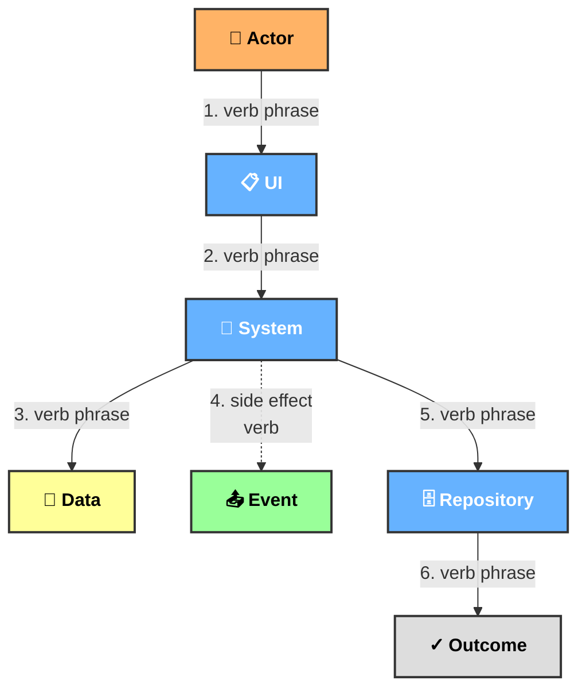

# Image-First Requirements Mapper — SpecForge Template

## Purpose

Provide a **deterministic, ambiguity-free method** for converting any software requirement into:
- A fixed set of image descriptions (Domain Picture, Interaction Picture, Storyboard)
- A fixed set of requirement segments (R1, R2, ..., Rn)
- A fixed high-level model with validated coverage

**The sequence, outputs, and interpretation rules are invariant.**
No step is optional. No step may reorder. No element may be interpreted subjectively.

---

## Deterministic Execution Order

Always execute these passes in **this exact order**:

1. **Pass 1 — Domain Picture** (Nouns → Boxes)
2. **Pass 2 — Interaction Picture** (Verbs → Arrows)
3. **Pass 3 — Requirement Segments** (Sentences → R-IDs)
4. **Pass 4 — Storyboard Panels** (Timeline → Visual Narrative)
5. **Pass 5 — Validation** (Non-Ambiguity Check)

No branching. No skipping. No merging.

---

## PASS 1 — DOMAIN PICTURE (NOUNS → BOXES)

### Extraction Rules

- Identify every **noun** referring to: actor, system, service, data object, or domain event.
- Exclude adjectives, metaphors, and narrative nouns.
- Deduplicate exact matches; treat plural/singular as identical.
- **Do not infer missing nouns.**

### Noun Categories

1. **Actors** — Who initiates action? (Human roles, user personas)
   - Example: Clinical Operations Coordinator
2. **UI Surfaces** — What interface receives input?
   - Example: HTTP POST Endpoint
3. **Systems / Services** — What processes the data?
   - Example: Referral Aggregate, IReferralRepository
4. **Data Objects** — What information is created/stored?
   - Example: ReferralDocument (Value Object), ReferralId
5. **Domain Events** — What state-changing event occurs?
   - Example: Referral-Submitted Event

### Mermaid Syntax (Mandatory)

**Use graph LR with flat node chain (NO subgraphs).**

Template:



```mermaid
graph LR
    LEGEND["📋 LEGEND — Box Types<br/>🔵 Actor | 🟦 System | 📄 Data | 📤 Event"]

    A1["👤 Label<br/>Description"]
    UI1["📋 Label<br/>Description"]
    SYS1["🔷 Label<br/>Description"]
    DATA1["📄 Label<br/>Description"]
    DATA2["🔑 Label<br/>Description"]
    EVT1["📤 Label<br/>Description"]

    LEGEND --- A1 --- UI1 --- SYS1 --- DATA1 --- DATA2 --- EVT1

    classDef actor fill:#FFB366,stroke:#333,stroke-width:2px,color:#000,font-weight:bold
    classDef system fill:#66B2FF,stroke:#333,stroke-width:2px,color:#fff,font-weight:bold
    classDef data fill:#FFFF99,stroke:#333,stroke-width:2px,color:#000,font-weight:bold
    classDef event fill:#99FF99,stroke:#333,stroke-width:2px,color:#000,font-weight:bold
    classDef legend fill:#EEEEEE,stroke:#999,stroke-width:1px,color:#000

    class A1 actor
    class UI1 system
    class SYS1 system
    class DATA1 data
    class DATA2 data
    class EVT1 event
    class LEGEND legend
```

### Icons (Mandatory — One Per Box Type)

| Type | Icon |
|---|---|
| Actor | 👤 |
| UI Surface | 📋 |
| System/Service | 🔷 |
| Repository | 🗄️ |
| Data Object | 📄 |
| Domain Event | 📤 |

### Color Mapping (Mandatory)

| Type | Color | Hex |
|---|---|---|
| Actor | Orange | #FFB366 |
| System/Service | Blue | #66B2FF |
| Data Object | Yellow | #FFFF99 |
| Domain Event | Green | #99FF99 |
| Legend | Light Gray | #EEEEEE |

### Ordering Rule (Non-Negotiable)

Chain nodes left-to-right **exactly in this order**:

1. **LEGEND** (leftmost, always first)
2. All **Actors** (orange)
3. All **UI Surfaces** (blue)
4. All **Systems/Services** (blue)
5. All **Repositories** (blue)
6. All **Data Objects** (yellow)
7. All **Domain Events** (green)

Connect with `---` (dashes, no arrows). Mermaid renders horizontally.

### Output — IMAGE: Domain Picture

- One Mermaid graph
- All nouns present as boxes
- Colors and icons match categories
- Left-to-right order enforced
- No arrows

---

## PASS 2 — INTERACTION PICTURE (VERBS → ARROWS)

### Extraction Rules

- Identify every **verb** describing: action, event, or data movement.
- Exclude verbs describing emotion, intention, or narrative flavor.
- **Do not infer missing actions.**

### Verb Types

1. **Primary Sequence** — Actions required to complete the requirement
   - Example: submits, forwards, validates, creates, stores, persists
2. **Side Effects** — Events emitted, state changes, notifications (non-blocking)
   - Example: publishes, emits, notifies
3. **Outcomes** — Result states achieved
   - Example: retrievable, available, accessible

### Mermaid Syntax (Mandatory)

**Use graph TD with strict linear flow.**

Template:



### Arrow Types (Mandatory)

| Arrow Type | Meaning | Symbol |
|---|---|---|
| Solid (`-->`) | Primary sequence, blocking action | Must complete before next |
| Dashed (`-.->`) | Side effect, event emission, non-blocking | Happens alongside, not sequentially |

### Numbering Rule

Label every arrow with **sequence number and verb**:

- `-->|1. submits via HTTP|` — Reader immediately sees step 1 of N

### Sequence Rule (Non-Negotiable)

Arrange flow **strictly TOP-TO-BOTTOM**:

1. Actor initiates
2. UI receives
3. System processes (all blocking steps sequentially)
4. Data created/validated (in order of creation)
5. Event published (dashed arrow — side effect)
6. Persistence (repository stores)
7. Outcome (state change complete)

### No Fanning From One Node

❌ **WRONG:**
```
SYS --> DATA1
SYS --> DATA2
SYS --> EVENT
```
Multiple arrows from one node = sequence ambiguity.

✅ **RIGHT:**
```
SYS -->|3. validates| DATA1
SYS -->|4. creates| DATA2
SYS -.->|5. publishes| EVENT
```
Linear flow. Each action feeds to next step.

### Output — IMAGE: Interaction Picture

- One Mermaid graph
- Vertical flow (top-to-bottom)
- Every verb extracted in Pass 2 appears as arrow label
- Numbered sequence (1, 2, 3, ...)
- Solid arrows for primary flow, dashed for side effects
- All nouns from Domain Picture appear as nodes

---

## PASS 3 — REQUIREMENT SEGMENTS (R1…Rn)

### Segmentation Rules

- Each requirement = **exactly one sentence or clause** from the story
- **No merging** of multiple story sentences
- **No splitting** of a single story sentence
- Requirements must be listed in **story order**

### Content Rules

Each requirement must contain:

1. **Trigger** — What initiates this?
2. **Actor/System** — Who/what performs it?
3. **Action** — What happens?
4. **Outcome/Data** — What results?

**Wording must be literal.** No interpretation or expansion.

### Mapping Rules

- Each requirement must reference **exact boxes/arrows** it maps to
- **No requirement without mapping**
- **No box/arrow without at least one requirement mapping**

### Template

```markdown
| R-ID | Requirement (Literal) | Maps To | Arrow ID |
|---|---|---|---|
| **R1** | Clinical operations coordinator submits a referral document via HTTP POST | Box: Coordinator, UI Endpoint | Arrow: 1-submits |
| **R2** | ... | Boxes/Arrows | ... |
```

### Output — REQUIREMENT SEGMENTS

List sequentially:

```
R1: [Literal requirement text] (Maps to: Box-ID-1, Box-ID-2, Arrow-1)
R2: [Literal requirement text] (Maps to: Box-ID-X, Arrow-2)
...
```

---

## PASS 4 — STORYBOARD PANELS (VISUAL NARRATIVE)

### Panel Rules

- Panels must follow **requirement order**
- Each panel covers **one or more consecutive requirements**
- **No panel skips a requirement**
- **No requirement appears in more than one panel**

### Drawing Rules

Each panel must specify:

- **Panel title** (exactly 3–5 words, no interpretation)
- **R-IDs included** (which requirements does this panel cover?)
- **Mermaid diagram**:
  - Boxes appear in **same order as Domain Picture**
  - **Only boxes referenced** by included R-IDs appear
  - **Only arrows referenced** by included R-IDs appear
  - **No inferred elements**

### Panel Structure

Each panel is a mini-Mermaid graph showing:
- Subset of nodes from Domain Picture
- Subset of arrows from Interaction Picture
- Only those relevant to the requirements covered in that panel

### Template

```markdown
**PANEL 1: Request Arrives** (R1, R2)
[Mermaid graph with only Coordinator, HTTP Endpoint, Referral Aggregate]

**PANEL 2: Validation & Creation** (R3, R4)
[Mermaid graph with only Referral Aggregate, Document, ReferralId]

...
```

### Output — IMAGE: Storyboard

- 3-4 panels, each with title, R-IDs, and Mermaid diagram
- Panels follow requirement order
- Clear narrative progression

---

## PASS 5 — VALIDATION (NON-AMBIGUITY CHECK)

### Validation Checklist

For **each requirement (R1…Rn):**
- [ ] Trigger is explicitly stated (not inferred)
- [ ] Actor/System is explicitly stated (not inferred)
- [ ] Action is explicitly stated (not inferred)
- [ ] Outcome/Data is explicitly stated (not inferred)
- [ ] Mapping references **existing boxes/arrows** (not invented)

For **each box/arrow:**
- [ ] At least one requirement references it
- [ ] No orphaned boxes or arrows

For **overall model:**
- [ ] No inferred elements were added
- [ ] All images follow deterministic ordering rules
- [ ] Domain Picture: left→right order maintained
- [ ] Interaction Picture: top→bottom causality maintained
- [ ] Storyboard: all panels present, no skip, no overlap
- [ ] All Pass 2 verbs appear in Interaction Picture
- [ ] All Pass 1 nouns appear in Domain Picture

### Coverage Matrix

| R-ID | Requirement | Boxes | Arrows | Status |
|---|---|---|---|---|
| R1 | ... | Box-1, Box-2 | Arrow-1 | ✓ Mapped |
| R2 | ... | Box-2, Box-3 | Arrow-2 | ✓ Mapped |
| ... | | | | |

| Box/Arrow | R-ID Coverage | Status |
|---|---|---|
| Box-1 | R1, R3 | ✓ Covered |
| Arrow-1 | R1, R2 | ✓ Covered |
| ... | | |

### Output — VALIDATION

List each requirement and its mapping status. List each box/arrow and its coverage status. **State whether the model is valid.**

If any mismatch exists:
- **The output is INVALID**
- Regenerate from Pass 1
- Do not proceed until validation passes

---

## OUTPUT ORDER (MANDATORY)

When applied to a requirement, **always output in this exact sequence**:

1. **IMAGE — Domain Picture** (Mermaid LR, flat chain, left-to-right)
2. **IMAGE — Interaction Picture** (Mermaid TD, numbered arrows, linear flow)
3. **REQUIREMENT SEGMENTS** (R1, R2, ..., Rn with mappings)
4. **IMAGE — Storyboard** (4 panels, each a mini-Mermaid, sequential)
5. **VALIDATION** (Coverage matrix + validity status)

**No additional commentary. No deviation from structure. No omitted sections.**

---

## How To Use This Template

1. **Obtain a requirement** (from SpecForge chain: requirements/ folder)
2. **Read the requirement completely.** Extract all nouns (Pass 1), all verbs (Pass 2)
3. **Execute Pass 1** — Create Domain Picture Mermaid diagram
4. **Execute Pass 2** — Create Interaction Picture Mermaid diagram
5. **Execute Pass 3** — Create Requirement Segments table
6. **Execute Pass 4** — Create Storyboard 4 panels
7. **Execute Pass 5** — Run validation checklist
8. **Save as** `requirements/EXAMPLE-REQ-NNN-VISUAL.md` in your project feature directory
9. **Link from requirement file** — Add cross-reference in `requirements/REQ-NNN.md`

---

## Examples

See working examples in SpecForge visual-mapping directory:
- `EXAMPLE-REQ-001-MAPPING.md` — Referral Intake (foundational, 7 requirements)
- `EXAMPLE-REQ-002-MAPPING.md` — AI Triage Processor (complex, 11 requirements)

Both are complete, working examples you can copy the pattern from.
